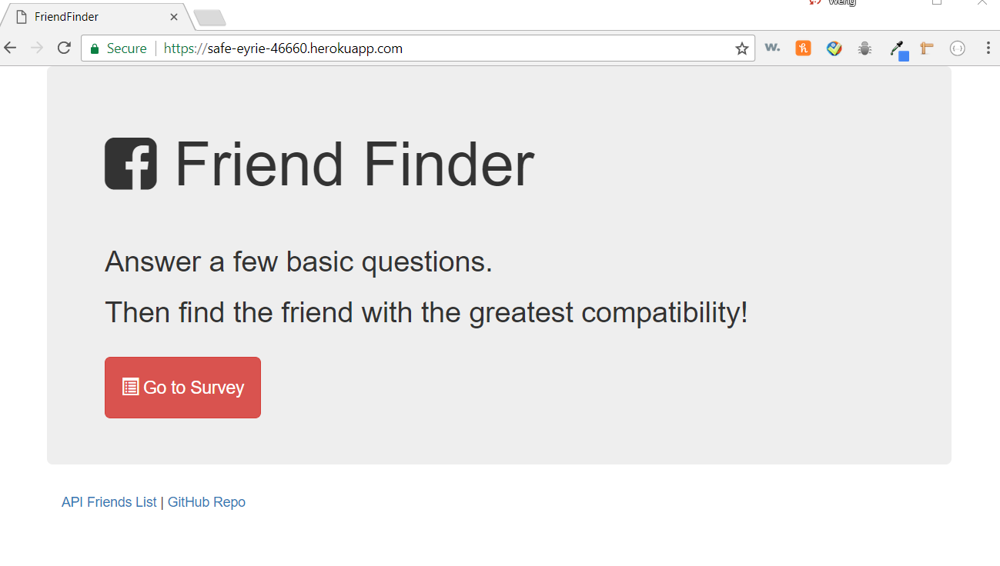
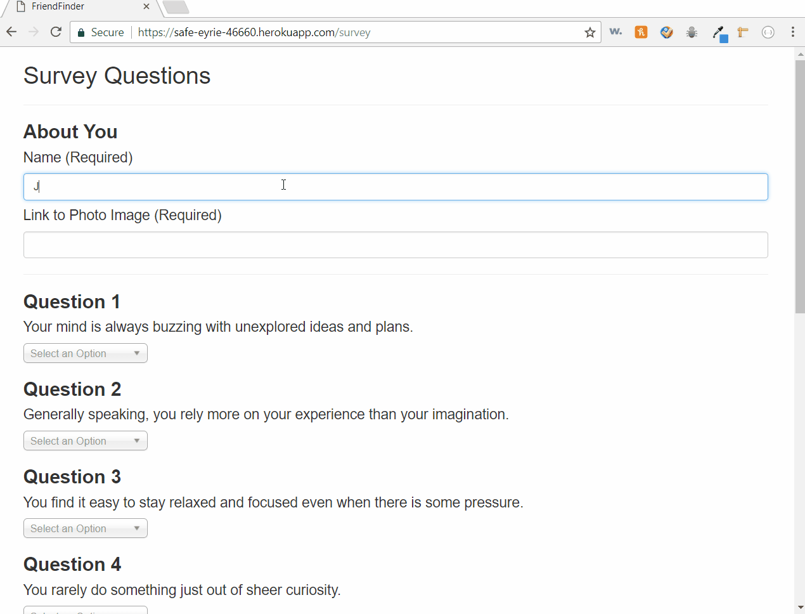

# Friend-Finder
This app is a compatibility-based "FriendFinder" application -- basically a dating app. This full-stack site will take in results from the users' surveys, then compare their answers with those from other users. The app will then display the name and picture of the user with the best overall match.

## How to use it

* Once the users link to the [Friend Finder Home Page](https://safe-eyrie-46660.herokuapp.com/), it will show the *Go to Survey* buttom. Then the users can link to the survey page right away.

* After link to the survey page, it will ask the user to enter name and a link of their photo. Next, they will answer 10 questions based on the scale of 1 - 5 with how much the users agree or disagree with each question.

* When they answered all the questions, they need to click the *submit* buttom to see the best match person's name and photo.

## Screen Shots

### HOME PAGE
 

### SURVEY PAGE 

## Technologies used 
- [Node.js](https://nodejs.org/en/)
- [Express NPM package](https://www.npmjs.com/package/express)
- [path NPM package](https://www.npmjs.com/package/path)
- [body parser json package](https://www.npmjs.com/package/body-parser-json)
- [Heroku(Cloud platform)](https://signup.heroku.com/?c=70130000001xDpdAAE&gclid=CjwKCAiAoNTUBRBUEiwAWje2ltBEcml0hz10Clvml8F1NM2EuanwpjS1Svoo0q8RwkeZJO4iiAQbYxoCmvQQAvD_BwE)
- [Bootstrap(Front-edn framework)](https://getbootstrap.com/)
